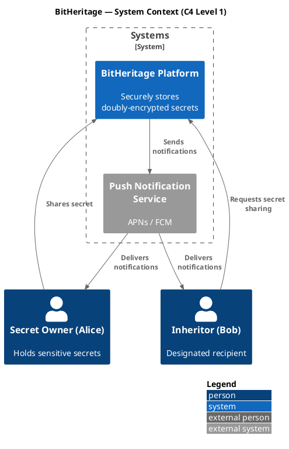
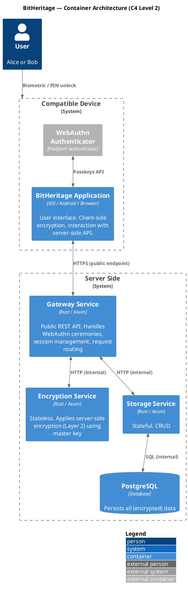
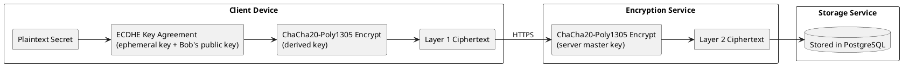
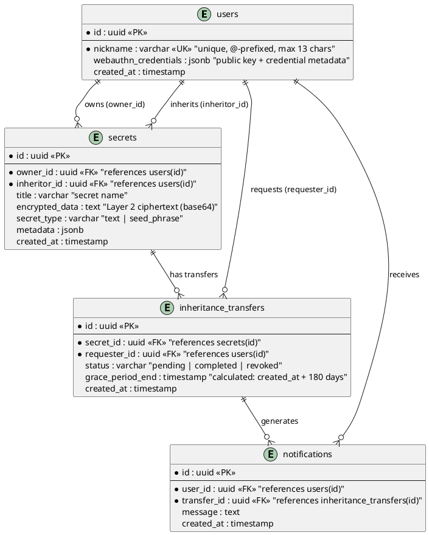

# BitHeritage — Architecture

**Version 0.1 — Initial Draft**

---

## Table of Contents

1. [System Context](#system-context)
2. [Container Architecture](#container-architecture)
3. [Component Architecture](#component-architecture)
4. [Network Topology](#network-topology)
5. [Cryptographic Architecture](#cryptographic-architecture)
6. [Data Model](#data-model)
7. [Key Flows](#key-flows)
8. [Verifiable Deployment](#verifiable-deployment)
9. [Technology Stack](#technology-stack)

---

## System Context

The C4 Level 1 (Context) diagram shows BitHeritage and the external actors that interact with it.

**Actors:**

- **Secret Owner (Alice)** — Registers with a passkey, encrypts secrets on-device, and shares them with a designated
  inheritor. Retains full control (deny/delete) until the grace period expires.
- **Inheritor (Bob)** — Registers with a passkey, requests access to shared secrets, and decrypts them on-device after
  the grace period.

**External Systems:**

- **Push Notification Service** — Apple Push Notification Service (APNs) and Firebase Cloud Messaging (FCM) deliver
  alerts to Alice when Bob initiates an inheritance claim.

---

## Container Architecture

The C4 Level 2 (Container) diagram shows the major deployable units.

### Client Side

| Component                   | Description                                                                                                                                                                                                               |
|-----------------------------|---------------------------------------------------------------------------------------------------------------------------------------------------------------------------------------------------------------------------|
| **Compatible Device**       | Any device supporting the WebAuthn standard — iPhone (Touch ID / Face ID), Android (fingerprint / face unlock), desktop browser (Windows Hello, security key). The device's secure enclave stores passkey material.       |
| **WebAuthn Authenticator**  | The platform authenticator built into the device OS.                                                                                                                                                                      |
| **BitHeritage Application** | The user-facing app (mobile or web). Orchestrates registration, authentication, secret sharing, and inheritance requests. Performs all Layer 1 encryption/decryption on-device using keys derived from the authenticator. |

### Server Side

All server-side services run within a **logically isolated network**. Only the Gateway Service exposes public endpoints.
The Encryption Service and Storage Service are unreachable from the outside.

| Component              | Description                                                                                                                                                                                               |
|------------------------|-----------------------------------------------------------------------------------------------------------------------------------------------------------------------------------------------------------|
| **Gateway Service**    | Exposes REST API endpoints over HTTPS. Handles WebAuthn registration/authentication ceremonies, session management, request routing to internal services.                                                 |
| **Encryption Service** | Internal-only, stateless service. Receives data from the Gateway, applies or removes Layer 2 encryption using a master key held exclusively in memory.                                                    |
| **Storage Service**    | Internal-only, stateful service. Provides a CRUD interface over PostgreSQL. Stores users, doubly-encrypted secrets, inheritance transfer records, and notifications. Enforces data integrity constraints. |
| **PostgreSQL**         | The persistent data store.                                                                                                                                                                                |

---

[//]: # (TODO add component architecture diagram)

## Cryptographic Architecture

### Key Types

| Key                            | Holder                                   | Purpose                                              |
|--------------------------------|------------------------------------------|------------------------------------------------------|
| **User Passkey (ECDSA P-256)** | Device-bound (secure enclave)            | WebAuthn authentication                              |
| **User Public Key**            | Server (public part only)                | Enables counterparties to encrypt secrets for this user |
| **Ephemeral Key (ECDH P-256)** | Generated per secret, discarded after use | Key agreement for Layer 1 encryption                 |
| **Derived Shared Secret**      | Computed on device via PRF extension     | Symmetric key for Layer 1          |
| **Server Encryption Key**      | Encryption service       | Symmetric key for Layer 2          |

### Layer 1: Client-Side Encryption (ECDHE)

For each secret, the sender's device:

1. Generates an ephemeral ECDH P-256 keypair.
2. Performs ECDH key agreement with the recipient's public key to produce a shared secret.
3. Derives an encryption key from the shared secret using HKDF-SHA256.
4. Encrypts the plaintext with ChaCha20-Poly1305 using the derived key and random nonce.
5. Gets the ciphertext ready to send to the server.

_Only the recipient, possessing the corresponding private key, can reverse the ECDH agreement to derive the same shared
secret and decrypt the data._

### Layer 2: Server-Side Encryption

1. Gateway Service: receives the Layer 1 ciphertext from the client and passes it to the Encryption Service.
2. Encryption service: encrypts it using the server master key and returns re-encrypted ciphertext.
3. Gateway Service: sends the re-encrypted ciphertext for storage.

_The master key is provisioned via environment variable and never written to disk or logs._

### Double Encryption Flow

---

## Data Model

**Constraints:**

- `secrets` has a unique constraint on `(owner_id, inheritor_id, title)` — one secret per owner-inheritor-title
  combination.
- Deleting a user cascades to their secrets, transfers, and notifications.
- Deleting a secret cascades to its transfers and related notifications.

---

## Verifiable Deployment

Trust in BitHeritage should not rely on the operator's reputation. The project adopts a **verifiable deployment** model.

### Open Source

All source code — client apps and server services — is published on GitHub under an open-source license. Anyone can
audit the cryptographic implementations, data handling, and access control logic.

### Build Attestations

Releases are built via GitHub Actions
with [artifact attestations](https://docs.github.com/en/actions/security-guides/using-artifact-attestations-to-establish-provenance-for-builds).
Each build produces a signed provenance record that links the binary artifact to a specific source commit, build
environment, and workflow definition.

### Deployment Verification

[//]: # (TODO add Deployment Verification)

---

## Technology Stack

| Component             | Technology                                 | Rationale                                                                                                                        |
|-----------------------|--------------------------------------------|----------------------------------------------------------------------------------------------------------------------------------|
| **Server language**   | Rust                                       | Memory safety, performance, strong type system. Eliminates entire classes of vulnerabilities (buffer overflows, use-after-free). |
| **Web framework**     | Axum                                       | Async, tower-based middleware ecosystem, first-class Rust support.                                                               |
| **Database**          | PostgreSQL                                 | Battle-tested relational database with strong data integrity guarantees, JSONB support for WebAuthn credentials.                 |
| **Cryptography**      | `ring` (Rust) / WebAuthn standard (client) | `ring` is a well-audited, high-performance crypto library. WebAuthn provides standardized passkey support across platforms.      |
| **Client (mobile)**   | React Native or Dart (Flutter)             | Cross-platform mobile development for iOS and Android from a single codebase.                                                    |
| **Client (web)**      | React                                      | Browser-based interface using the Web Authentication API.                                                                        |
| **CI/CD**             | GitHub Actions                             | Native integration with GitHub, artifact attestation support.                                                                    |
| **Container runtime** | Docker                                     | Reproducible builds, isolated deployment.                                                                                        |
